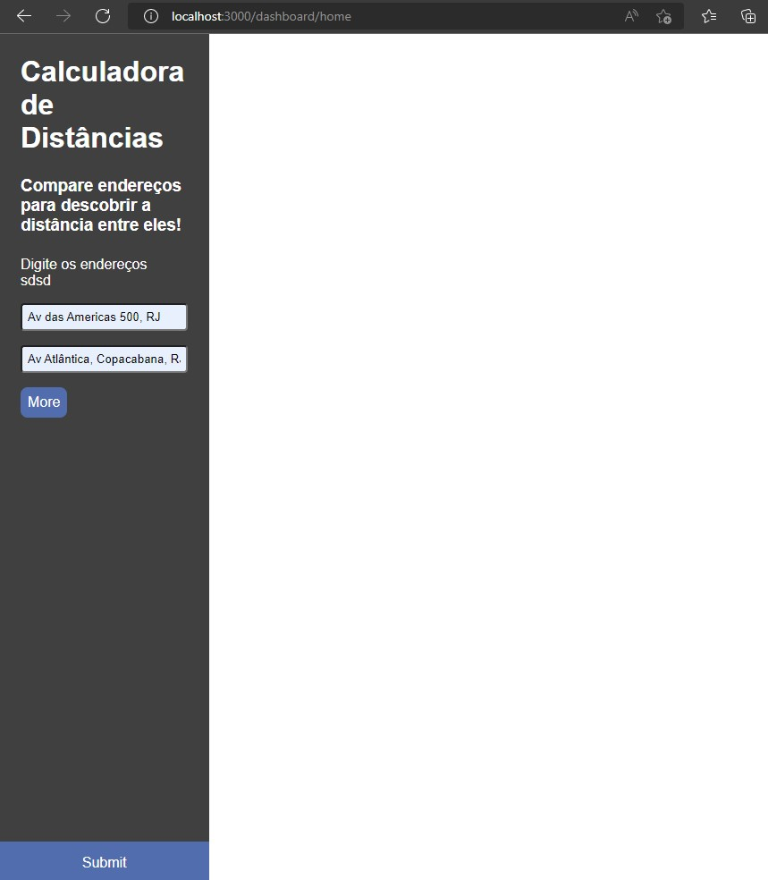

# Maps React

This is a typescript react project who uses <a target='blank'  href="https://github.com/HenriqueGomesOriginal/ApiRestMaps">ApiRestMaps</a>

## Running

To run this project simple type 'npm start' to test 'npm test', default url is http://localhost:3000/dashboard/home

## Libs

- styled-components
- formik
- react-router 6
- axios
- i18n-next
- jest

## Preview

## Learn More

You can learn more in the [Create React App documentation](https://facebook.github.io/create-react-app/docs/getting-started).

To learn React, check out the [React documentation](https://reactjs.org/).
